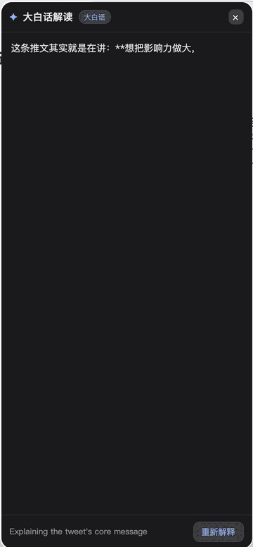
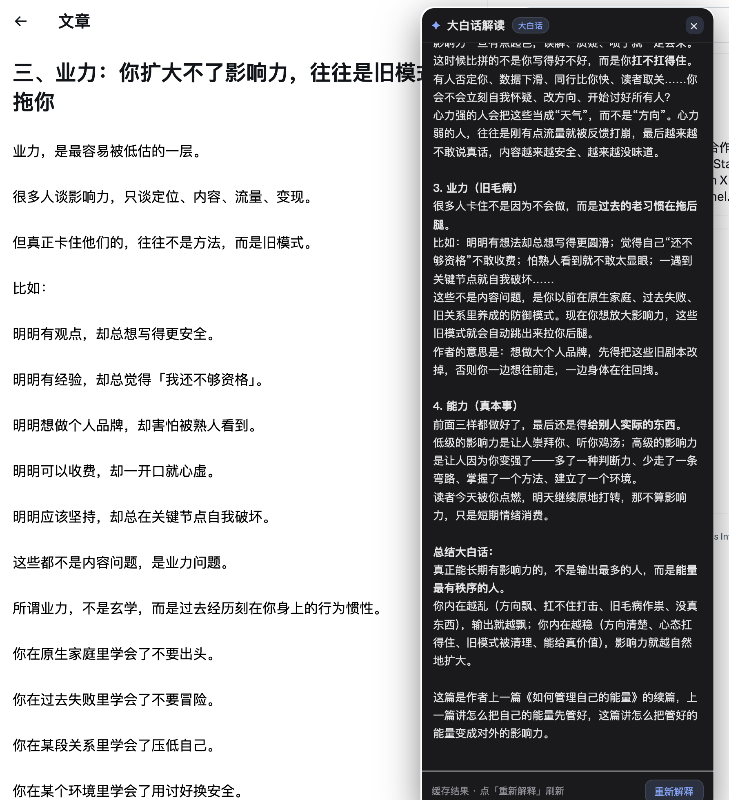

# X 大白话 · Grok 解读增强

**简体中文** · [English](./README.en.md)

悬停 X（Twitter）上的任意推文或长文「文章」，自动用**大白话、口语化的中文**解释它在讲什么——结果以一张炫酷卡片就地展示。

<p align="center">
  
  &nbsp;&nbsp;
  
</p>

> 巧妙之处：插件**不碰任何签名、不存任何凭证**。它复用 X 自己已经签名好的 Grok 请求，只在请求发出前把内容改写成「说人话」的指令，再把 Grok 的流式回答读出来渲染。

## 功能

- **悬停即解读**：鼠标停在推文上，转一圈进度环后自动触发；也可点环立即触发。
- **真·大白话**：接管 X 内置的 Grok「解读」，把官方那套分析改写成口语化中文，流式输出，带来源引用角标 `[n]`。
- **支持 X 长文「文章」**：
  - 时间线上的文章卡片 —— 保留 X 的分析上下文，让后端照常读取文章正文；
  - 文章详情页（无内联 Grok 按钮）—— 直接抓取页面里的全文，驱动 Grok 抽屉完成总结。
- **三种模式**：
  - `grok` 真·大白话（默认）
  - `demo` 纯 UI 演示，不调用 Grok
  - `learn` 学习模式，抓取 Grok 请求结构（凭证自动打码）便于研究
- **结果缓存**：同一条推文秒出，点「重新解释」可强制刷新。
- **主题**：graphite / light / ocean / neon / 跟随系统。
- **隐藏原生抽屉**：把 X 自己弹出的 Grok 抽屉移到屏幕外（而非关闭，避免打断流式请求）。

## 安装（加载已解压的扩展）

1. 下载/克隆本仓库到本地：
   ```bash
   git clone https://github.com/nodlles/x-grok-dabaihua.git
   ```
2. 打开 `chrome://extensions/`，右上角开启「开发者模式」。
3. 点「加载已解压的扩展程序」，选择本仓库目录。
4. 打开 [x.com](https://x.com)，把鼠标停在任意推文上即可。

> 需要在已登录 X 的浏览器里使用（Grok 解读依赖你自己的登录态）。本扩展仅声明 `storage` 权限，host 限定在 `x.com` / `twitter.com`。

## 设置

点扩展图标或在 `chrome://extensions` 里打开「选项」可配置：开关、模式、悬停时长、主题、自定义 prompt、是否隐藏原生抽屉，以及（猜不中时）手动填写抽屉选择器。

## 工作原理

| 文件 | 世界 | 职责 |
|---|---|---|
| `inject.js` | MAIN | 包裹 `fetch`/`XHR`，按**请求体形状**识别 Grok `add_response`；武装后改写 message 为大白话指令，并流式解析 NDJSON 回传 |
| `content.js` | ISOLATED | hover 进度环、卡片 UI、提取推文/文章正文、定位并点击 Grok 入口、接收主世界消息渲染 |
| `render.js` / `cardui.js` / `cache.js` / `card.css` | ISOLATED | 富文本渲染、卡片交互、缓存、样式 |
| `options.html` / `options.js` | — | 设置页 |

两个世界通过 `window.postMessage` 通信。改写时：
- 普通推文（DOM 里有正文）→ 把正文塞进 prompt、切成普通聊天；
- 文章/图视频帖（DOM 里没正文）→ **保留** `promptMetadata`，让 X 后端补正文，只追加「说大白话」的风格要求。

## 免责声明

非官方第三方工具，与 X / xAI 无关。仅供个人学习研究使用，请遵守 X 的服务条款。

## License

[MIT](./LICENSE) © 2026 nodlles
