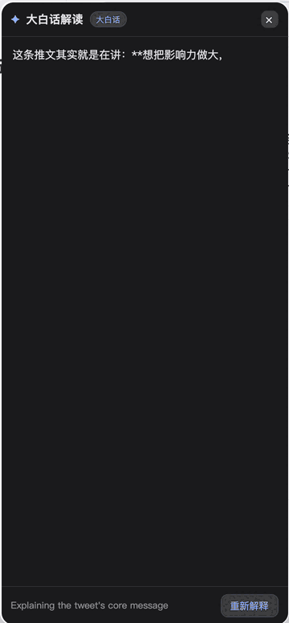
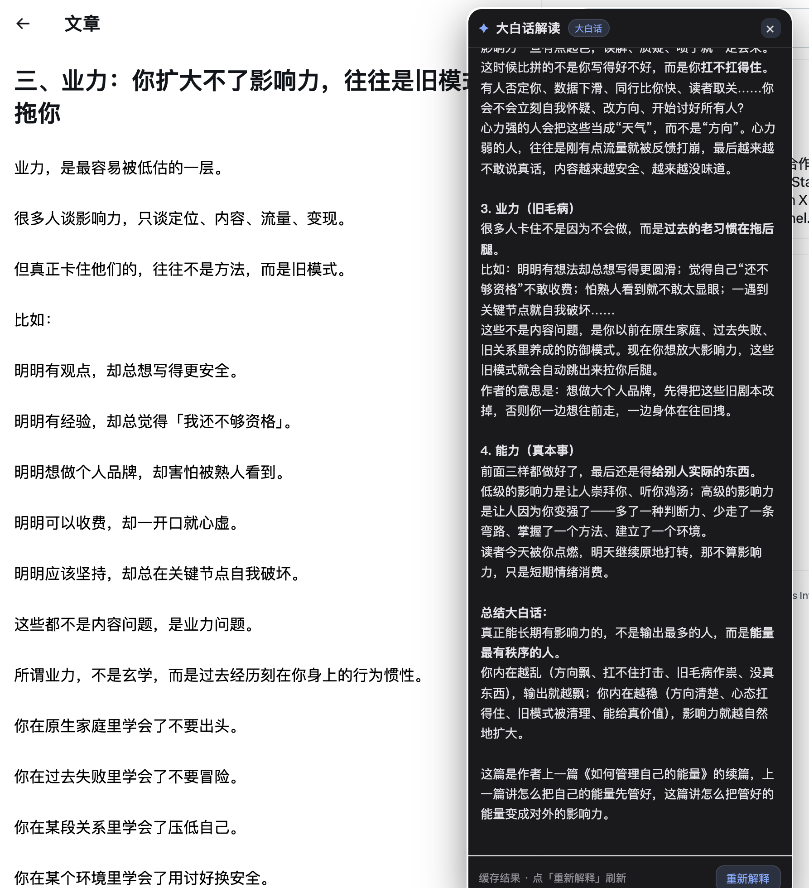

# X 大白话 · Grok 解读增强

**简体中文** · [English](./README.en.md)

悬停 X（Twitter）上的任意推文或长文「文章」，自动用**大白话、口语化的中文**解释它在讲什么——结果以一张炫酷卡片就地展示。

<p align="center">
  
  &nbsp;&nbsp;
  
</p>

> 巧妙之处：插件复用 X 页面原有的 Grok 登录请求，改写解读指令并展示回答。帖子文本、链接和追问背景会发送给 X/Grok；开发者不接收这些内容。详见[隐私政策](docs/PRIVACY.md)。

## 功能

- **悬停即解读**：鼠标停在推文上，转一圈进度环后自动触发；也可点环立即触发。
- **真·大白话**：接管 X 内置的 Grok「解读」，把官方那套分析改写成口语化中文，流式输出，带来源引用角标 `[n]`。
- **支持 X 长文「文章」**：
  - 时间线上的文章卡片 —— 保留 X 的分析上下文，让后端照常读取文章正文；
  - 文章详情页（无内联 Grok 按钮）—— 直接抓取页面里的全文，驱动 Grok 抽屉完成总结。
- **三种模式**：
  - `grok` 真·大白话（默认）
  - `demo` 纯 UI 演示，不调用 Grok
  - `learn` 学习模式，手动开启请求捕获后保存调试记录（敏感请求头自动打码）
- **多轮追问**：解读完成后直接在卡片输入问题，保留原解读并逐轮展示回答；缓存结果也能继续追问。
- **在 Grok 中继续**：将原文、解读、来源和已完成问答填入 X 原生 Grok 输入框，由你编辑并发送。
- **结果缓存**：同一条推文秒出，点「重新解释」可强制刷新。
- **主题**：graphite / light / ocean / neon / 跟随系统。
- **隐藏原生抽屉**：仅在解读期间把 X 自己弹出的 Grok 抽屉移到屏幕外；解读完成、出错、超时或关闭卡片后恢复原有样式。

## 安装（加载已解压的扩展）

1. 下载/克隆本仓库到本地：
   ```bash
   git clone https://github.com/nodlles/x-grok-dabaihua.git
   ```
2. 打开 `chrome://extensions/`，右上角开启「开发者模式」。
3. 点「加载已解压的扩展程序」，选择本仓库目录。
4. 打开 [x.com](https://x.com)，把鼠标停在任意推文上即可。

> 需要在已登录 X 的浏览器里使用（Grok 解读依赖你自己的登录态）。本扩展仅声明 `storage` 权限，host 限定在 `x.com` / `twitter.com`。

## 设置

点扩展图标或在 `chrome://extensions` 里打开「选项」可配置：开关、模式、悬停时长、主题、自定义 prompt、是否隐藏原生抽屉，以及（猜不中时）手动填写抽屉选择器。

请求捕获默认关闭，且仅在插件启用、选择「学习」模式并开启捕获开关时生效。已有开关设置会保留，但在大白话和演示模式下不捕获。记录包含请求正文及响应样本，可能含聊天内容；最多保存 30 条，仅存于本机，可在设置页查看、复制或清空。复制分享前请自行检查正文和响应，敏感请求头打码不代表整条记录已脱敏。

关闭卡片、重新解释或切换模式会停止旧任务的自动点击、等待和卡片读取；已经由 X 发出的请求可能继续运行并消耗额度，插件不会中止 X 自己的请求。解读等待首响应超过 10 秒、或整体超过 120 秒时结束等待。

## 继续追问

- 在大白话模式下，初次解读完成后输入问题，按 Enter 或点「发送」；Shift+Enter 换行，中文输入法选字不会触发发送。
- 进入输入框后，对话会固定；鼠标移到其他推文或点击卡片外部不会关闭，点右上角 × 结束对话。
- 每次追问会带上原文、初次解读、引用来源和已完成问答。回答失败时，问题回填到输入框，可编辑后重新发送。失败或未完成的回答不会作为后续背景。
- 「在 Grok 中继续」只填入背景和当前问题，不自动发送，也不会覆盖原生输入框已有的草稿。后续在原生 Grok 的问答不会同步回卡片。
- 单次问题最多 2,000 字符，对话背景最多 60,000 字符；超限会提示，不会静默丢弃上下文。长对话可复制需要的内容到 Grok 继续。
- 多轮问答仅保留在当前卡片内存中；关闭卡片、刷新页面或点「重新解释」会清空，持久缓存仍只保存初次解读。追问使用你的 Grok 额度。

## 开发验证

需要 Node.js 20 或更新版本，无需安装依赖：

```bash
node --test tests/*.test.cjs
```

测试通过模拟 DOM、扩展存储和计时器执行实际脚本，覆盖任务取消、抽屉恢复、捕获开关、流式读取、多轮追问与原生草稿保护；不能替代登录 X 后对实际按钮、抽屉和接口的兼容性验证。修改后在 `chrome://extensions/` 重新加载扩展，并刷新 X 页面。

## 工作原理

| 文件 | 世界 | 职责 |
|---|---|---|
| `inject.js` | MAIN | 包裹 `fetch`/`XHR`，按**请求体形状**识别 Grok `add_response`；武装后改写 message 为大白话指令，并流式解析 NDJSON 回传 |
| `content.js` | ISOLATED | hover 进度环、卡片 UI、提取推文/文章正文、定位并点击 Grok 入口、接收主世界消息渲染 |
| `render.js` / `cardui.js` / `cache.js` / `card.css` | ISOLATED | 富文本渲染、卡片交互、缓存、样式 |
| `conversation.js` | ISOLATED | 组装原文、解读、来源与多轮问答背景，校验长度 |
| `options.html` / `options.js` | — | 设置页 |

两个世界通过 `window.postMessage` 通信。改写时：
- 普通推文（DOM 里有正文）→ 把正文塞进 prompt、切成普通聊天；
- 文章/图视频帖（DOM 里没正文）→ **保留** `promptMetadata`，让 X 后端补正文，只追加「说大白话」的风格要求。

## 免责声明

非官方第三方工具，与 X / xAI 无关。仅供个人学习研究使用，请遵守 X 的服务条款。

## License

[MIT](./LICENSE) © 2026 nodlles
